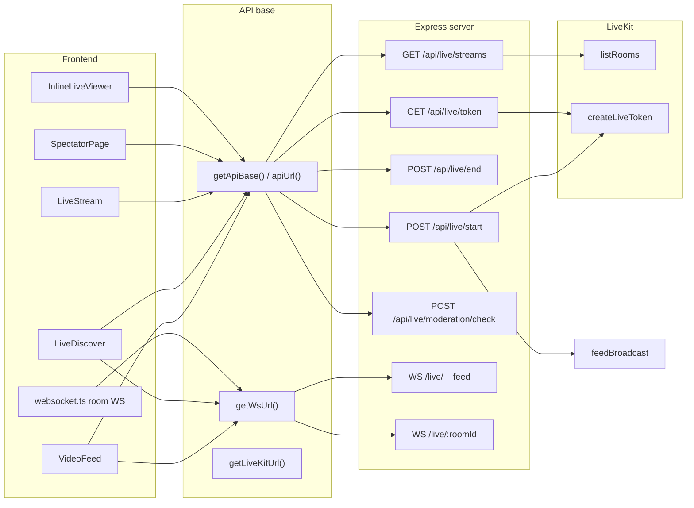

# Live code audit and server connection fix

## Current connection flow (verified)




- **API base**: [src/lib/api.ts](src/lib/api.ts) — `apiUrl(path)` uses `getApiBase()` (empty in local dev, `VITE_API_URL` or `window.__ENV.VITE_API_URL` in production). All live REST calls in the app use `apiUrl(...)` **except one** (see below).
- **WebSocket base**: `getWsUrl()` — same-origin in dev; `VITE_WS_URL` or derived from current host in prod. Used for `/live/:roomId` (chat/gifts/room) and `/live/__feed__` (realtime stream list).
- **LiveKit URL**: `getLiveKitUrl()` from `VITE_LIVEKIT_URL` / env; used by SpectatorPage and LiveStream after fetching token from the server.
- **Server**: [server/index.ts](server/index.ts) mounts all live routes and feed WebSocket; [server/routes/livestream.ts](server/routes/livestream.ts) implements REST and calls [server/feedBroadcast.ts](server/feedBroadcast.ts) for `stream_started` / `stream_ended`; [server/services/livekit.ts](server/services/livekit.ts) uses LiveKit SDK and `listActiveRoomsFromLiveKit()` for GET /api/live/streams.

## Bug to fix (app not connected to server in production)

**File:** [src/pages/LiveStream.tsx](src/pages/LiveStream.tsx) (around line 2152)

**Issue:** The live moderation check request uses a **hardcoded path**:

```ts
const res = await fetch('/api/live/moderation/check', {
  method: 'POST',
  headers: { 'Content-Type': 'application/json', Authorization: `Bearer ${token}` },
  body: JSON.stringify({ stream_key: effectiveStreamId, image_base64: base64 }),
});
```

When the app is deployed with a different origin than the API (e.g. front on Coolify, API on same host but `VITE_API_URL` set), `fetch('/api/...')` goes to the **frontend origin**, not the API server. So the moderation check never hits the backend and can fail or be ignored.

**Fix:**

- Use `apiUrl('/api/live/moderation/check')` for the request URL (and ensure `apiUrl` is imported from `../lib/api` if not already).
- Add `credentials: 'include'` so cookies are sent, consistent with other live endpoints.

No other live call sites use a raw `/api/...` path; they already use `apiUrl()` or `getWsUrl()`.

## Verification steps (no code change unless you apply the fix above)

1. **Run lint and typecheck** on the repo (e.g. `npm run lint`, `npm run check` or `tsc -b --noEmit`) to ensure there are no existing errors in live-related files (e.g. `VideoFeed.tsx`, `LiveDiscover.tsx`, `LiveStream.tsx`, `SpectatorPage.tsx`, `websocket.ts`, `server/index.ts`, `server/routes/livestream.ts`, `server/feedBroadcast.ts`, `server/services/livekit.ts`).
2. **Confirm env for deploy:** In production, set `VITE_API_URL`, `VITE_WS_URL`, and `VITE_LIVEKIT_URL` (and optionally `window.__ENV` via `/env.js`) so that `apiUrl()`, `getWsUrl()`, and `getLiveKitUrl()` point at the same server and LiveKit. Then the app is fully connected to the server for live (stream list, start/end, token, feed WS, room WS, and after the fix, moderation check).

## Optional: other hardcoded `/api/` call sites (non-live)

These are outside the “live” scope but also break when the frontend origin differs from the API:

- [src/pages/Settings.tsx](src/pages/Settings.tsx): `fetch('/api/delete-account', ...)`
- [src/lib/iap.ts](src/lib/iap.ts): `fetch('/api/verify-purchase', ...)`
- [src/components/UserProfileModal.tsx](src/components/UserProfileModal.tsx), [src/components/EnhancedLikesModal.tsx](src/components/EnhancedLikesModal.tsx): `fetch('/api/block-user', ...)`
- [src/lib/analytics.ts](src/lib/analytics.ts): `fetch('/api/analytics/track', ...)`

Recommend fixing these in a follow-up pass by switching to `apiUrl(...)` and `credentials: 'include'` where appropriate.

## Summary

- **Live code and connections:** All live paths (streams, start, end, token, feed WS, room WS, spectator token, LiveKit URL) use the shared API/WS/LiveKit helpers; only the **moderation check** in LiveStream uses a hardcoded URL.
- **Fix:** Use `apiUrl('/api/live/moderation/check')` and `credentials: 'include'` in [src/pages/LiveStream.tsx](src/pages/LiveStream.tsx).
- **Then:** Run lint/typecheck and confirm production env so the app is fully connected to the server and has no errors before you consider the live flow complete.

