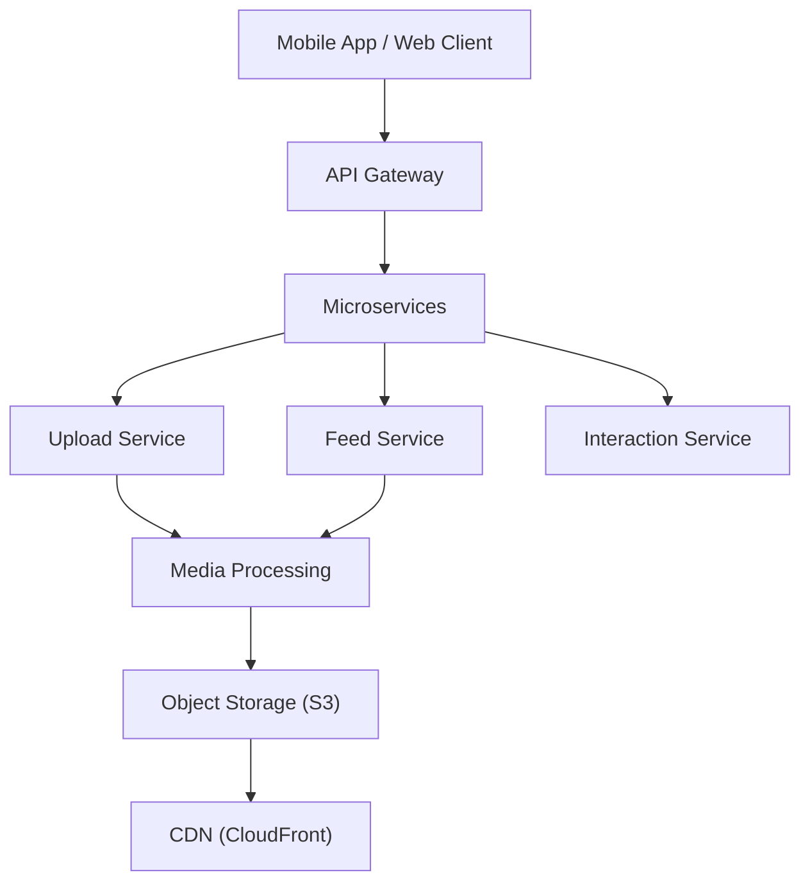

# High-Level System Architecture

This document describes the **target** architecture (microservices, upload pipeline, feed recommendation, CDN) and how the **current** Elix Star Live app maps to it, plus an optional evolution path.

---

## Target Architecture

Main systems in the target design:

- **Upload system** — Upload Service → Object Storage → Event Queue → Workers
- **Video processing pipeline** — Transcoding, thumbnails, multi-format, moderation
- **Feed recommendation system** — Candidate fetch → Ranking (ML) → cached feed
- **Content delivery (CDN)** — Edge delivery for video/thumbnails
- **Analytics + ML training** — Event pipeline for signals and model training

---

## Current vs Target

| System | Target | Current app |
|--------|--------|-------------|
| **Entry** | API Gateway | Single Express server (no gateway) |
| **Upload** | Upload Service → S3 → Event Queue → Workers | Express upload routes; Bunny/FS storage; no Kafka/RabbitMQ |
| **Video processing** | Transcoding, thumbnails, 240p–1080p, moderation | Minimal or single-format; live moderation exists |
| **Feed** | Feed Service → candidates → Ranking (ML) → cache | `GET /api/feed/foryou` (page/offset); live from `GET /api/live/streams` + feed WebSocket; in-memory feed cache; no ML ranking |
| **Delivery** | CDN in front of object storage | Bunny CDN (VITE_CDN_URL / VITE_BUNNY_*); video URLs can go through CDN |
| **Real-time** | WebSocket Gateway → Pub/Sub (Redis/Kafka) | Express + `ws`; in-memory rooms and feed broadcast |
| **Analytics** | Event collector → Kafka → warehouse | Track-view / track-interaction endpoints; no formal pipeline |
| **Storage** | Metadata DB + Graph DB + Object Storage | Postgres/Supabase + Bunny (object); single DB |

Today: **monolith Express app** with LiveKit (live), upload, feed, and WebSockets. No API gateway, no event-driven processing queue, no ML ranking, no Redis feed cache (in-memory only), no formal analytics pipeline.

---

## Production Config (Live & Feed)

For **live on For You** and correct API/WS routing in production:

1. **Server**
   - `LIVEKIT_URL`, `LIVEKIT_API_KEY`, `LIVEKIT_API_SECRET` — required so `GET /api/live/streams` uses LiveKit and all instances see the same rooms.
   - See [.env.example](../.env.example) for names.

2. **Frontend (build or runtime)**
   - `VITE_API_URL` — backend base URL (e.g. `https://www.anberlive.co.uk`). Used by `apiUrl()` for all REST calls.
   - `VITE_WS_URL` — WebSocket base (e.g. `wss://www.anberlive.co.uk`). Used for `/live/:roomId` and `/live/__feed__`.
   - `VITE_LIVEKIT_URL` — LiveKit server URL for the client.
   - If the app is served from the same origin as the API, relative URLs work; otherwise set these in the build (e.g. Coolify env) or via `/env.js` (`window.__ENV`).

3. **Optional**
   - `REDIS_URL` — when set, feed cache can use Redis instead of in-memory for multi-instance deployments (see Phase 2).

### Feed API (cursor-based pagination)

- **Infinite scroll:** `GET /api/feed/foryou?limit=20` returns the first page. Response includes `next_cursor` when more items exist.
- **Next page:** `GET /api/feed/foryou?cursor=<next_cursor>&limit=20` returns the next page. Backward compatible: `?page=2&limit=20` still works.
- **Cache:** In-memory per-user (or per anonymous) with 60s TTL. For multiple server instances, set `REDIS_URL` and use a Redis-backed feed cache (see [server/routes/feed.ts](../server/routes/feed.ts)).

### CDN (content delivery)

- Video and thumbnail URLs should be served via CDN to reduce latency and backend load. Use `VITE_CDN_URL` / Bunny CDN (`VITE_BUNNY_CDN_HOSTNAME`, `VITE_BUNNY_STORAGE_ZONE`) so the client loads media from the CDN edge. See [.env.example](../.env.example).

---

## Evolution Path

Phased approach to move toward the target without breaking the app.

### Phase 1 — Stabilize and document (done)

- Document current and target architecture (this file).
- Ensure production config above for live and feed.

### Phase 2 — Feed and delivery

- **Cursor-based pagination:** `GET /feed?cursor=...` with `next_cursor` for infinite scroll.
- **Feed cache:** Redis (or similar) per user with TTL 30–120 s when `REDIS_URL` is set; fallback to in-memory.
- **CDN:** Ensure video/thumbnail URLs use CDN (e.g. `VITE_CDN_URL` / Bunny); document in deploy docs.

### Phase 3 — Upload and processing

- **Upload boundary:** [server/routes/upload.ts](../server/routes/upload.ts) accepts uploads and writes to Bunny (object storage). After a successful upload it calls [server/lib/uploadEvents.ts](../server/lib/uploadEvents.ts) `publishVideoUploaded(payload)` with event shape `{ path, cdnUrl, userId, contentType, uploadedAt, sizeBytes }`. This is a no-op until a queue (Kafka/RabbitMQ or cloud queue) is configured; then wire `publishVideoUploaded` to push to the queue.
- **Workers (future):** Consume `video.uploaded` from the queue → transcoding (e.g. FFmpeg), thumbnails, multiple formats, moderation → write processed files to storage and update metadata DB.
- Client API unchanged; internal flow is ready to become event-driven when a queue is added.

### Phase 4 — Recommendation and analytics

- **Signals (current):** The app tracks watch time, likes, comments, shares, follows via [server/routes/feed.ts](../server/routes/feed.ts): `POST /api/feed/track-view`, `POST /api/feed/track-interaction`. These update engagement stats used for ranking. Target: event collector → Kafka (or similar) → stream processing → data warehouse for ML training.
- **Ranking (current):** Feed uses `computeScore` with weights (watch_time, likes, comments, shares, completions) and `personalizeAndRank` for logged-in users (following, interests, watched/not-interested, liked categories). Target: candidate retrieval → ranking model (heuristic or ML) → optional re-ranking; serve from Feed Service with cache.
- Optionally split Interaction Service (likes, comments, follows) as a separate service or module.

### Phase 5 — Gateway and scale

- **API Gateway:** Put an API Gateway (or reverse proxy, e.g. nginx, AWS API Gateway) in front of the app so routing, rate limiting, and TLS are centralized. Today a single Express server handles all routes.
- **Real-time scaling:** WebSocket rooms and feed broadcast are in-memory. To run multiple server instances, use **Pub/Sub** (e.g. Redis Pub/Sub or Kafka): when a client sends a message or a stream ends, publish to a channel; all instances subscribed to that channel push to their connected clients. See [server/feedBroadcast.ts](../server/feedBroadcast.ts) and [server/index.ts](../server/index.ts) (rooms, `__feed__`).
- **Horizontal scaling:** Load balancer → multiple instances; shared state via Redis (feed cache, session, Pub/Sub) and a distributed DB. Live stream list is already shared via LiveKit `listRooms()` so all instances see the same rooms.

---

## References

- Feed: [server/routes/feed.ts](../server/routes/feed.ts) — `handleForYouFeed`, cache, scoring.
- Live: [server/routes/livestream.ts](../server/routes/livestream.ts), [server/feedBroadcast.ts](../server/feedBroadcast.ts), [server/services/livekit.ts](../server/services/livekit.ts).
- Upload: Express upload routes and Bunny (see [.env.example](../.env.example) for `BUNNY_*`, `VITE_BUNNY_*`).
