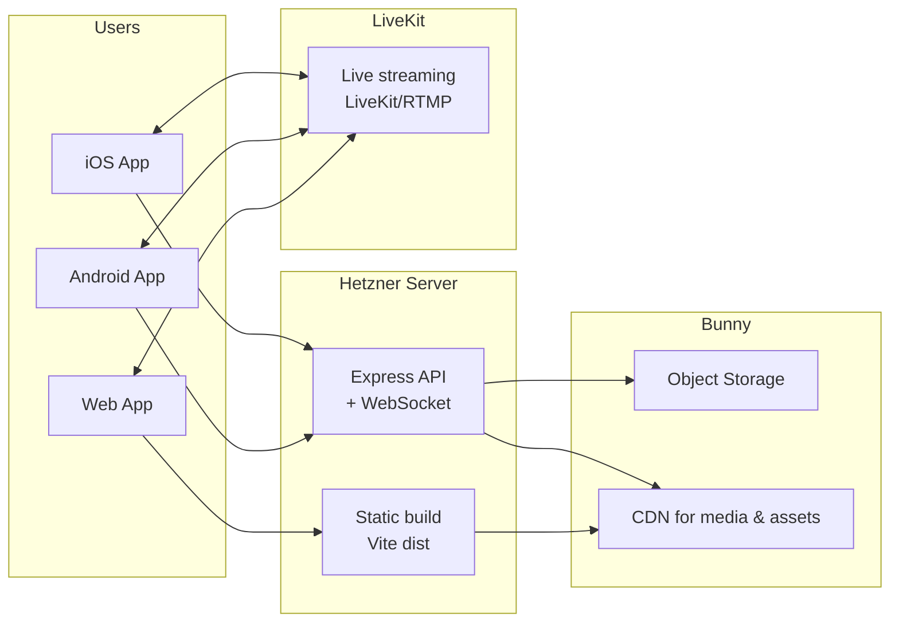

# UX Flow + Conexiuni (One-Glance)

Document pentru iOS / Android / Web: ecrane, conexiuni UX (tabs/drawers/sheets/modals) și legături către API / realtime / storage / 3rd-party.

## 1) UX Flow complet (Screens + conexiuni)

```mermaid
flowchart TB
  %% =======================
  %% ENTRY / AUTH
  %% =======================
  subgraph AUTH[Onboarding & Auth]
    SPL[Splash]
    WEL[Welcome\nLogin / Sign up]
    LOG[Login]
    REG[Register]
    PICK[Pick username + avatar\n(optional)]
    PERM[Permissions\nCamera/Mic/Notifications]
    SPL --> WEL
    WEL --> LOG
    WEL --> REG
    LOG --> PERM
    REG --> PICK --> PERM
  end

  %% =======================
  %% MAIN SHELL (BOTTOM TABS)
  %% =======================
  subgraph SHELL[Main App Shell\nBottom Tabs fixed]
    TABS[Tabs:\nHome | Discover | Create | Inbox | Profile]
  end
  PERM --> TABS

  %% =======================
  %% HOME TAB
  %% =======================
  subgraph HOME[Home (Feed)]
    H1[Home Feed\nFor You / Following\nSwipe vertical]
    VD[Video Detail\n(same player context)]
    CD[Comments Drawer]
    SH[Share Sheet]
    GF[Gift Sheet]
    RP[Report Modal]
    CP[Creator Profile]
    H1 --> VD
    VD --> CD
    VD --> SH
    VD --> GF
    VD --> RP
    H1 --> CP
    CP --> GF
    CP --> RP
    CP --> DMJ[DM Jump]
  end

  %% =======================
  %% DISCOVER TAB
  %% =======================
  subgraph DISC[Discover (Search)]
    D1[Discover\nTrending tags/creators/sounds]
    SB[Search Bar]
    SR[Search Results\nTabs: Videos/Users/Sounds/Tags]
    VRES[Open Video]
    URES[Open Creator]
    SRES[Open Sound Page]
    TRES[Open Tag Page]
    D1 --> SB --> SR
    SR --> VRES --> VD
    SR --> URES --> CP
    SR --> SRES --> VD
    SR --> TRES --> VD
  end

  %% =======================
  %% CREATE TAB
  %% =======================
  subgraph CREATE[Create (+)]
    C1[Create Entry\nRecord / Upload]
    CAM[Camera Record\n15s/30s]
    UPL[Upload from Gallery]
    ED[Editor\nTrim/Crop/Cover]
    CAP[Caption + Hashtags\nSelect sound]
    POST[Post / Publish]
    C1 --> CAM --> ED
    C1 --> UPL --> ED
    ED --> CAP --> POST --> SH
  end

  %% =======================
  %% INBOX TAB
  %% =======================
  subgraph INBOX[Inbox]
    I1[Inbox Home\nNotifications + DMs]
    NT[Notifications List]
    TH[DM Threads]
    CHAT[Chat Room]
    UP[User Profile (view)]
    I1 --> NT
    I1 --> TH --> CHAT
    CHAT --> UP --> CP
  end

  %% =======================
  %% PROFILE TAB
  %% =======================
  subgraph PROF[Profile]
    P1[My Profile]
    EP[Edit Profile]
    WA[Wallet]
    ST[Settings]
    MYV[My Videos]
    SAV[Saved]
    LIK[Liked]
    P1 --> EP
    P1 --> WA
    P1 --> ST
    P1 --> MYV --> VD
    P1 --> SAV --> VD
    P1 --> LIK --> VD
  end

  %% =======================
  %% LIVE (GLOBAL ENTRY)
  %% =======================
  subgraph LIVE[Live]
    ENTRY[Entry points:\nHome/Discover/Profile]
    LVR[Live Room Viewer\nvideo + chat + gifts + hearts]
    GL[Go Live (Host setup)\nTitle/Category/Start]
    LHOST[Live Host Room\ncamera preview + stream + chat]
    ENTRY --> LVR
    ENTRY --> GL --> LHOST
    LVR --> GF
    LHOST --> GF
  end

  %% Tab connections
  TABS --> H1
  TABS --> D1
  TABS --> C1
  TABS --> I1
  TABS --> P1

  %% DM jump from creator profile
  DMJ --> CHAT

  %% Live entry can be triggered from multiple tabs
  H1 --> ENTRY
  D1 --> ENTRY
  P1 --> ENTRY
```

## 2) Conexiuni tehnice (ce cheamă ce) — pe ecrane

### Auth
- Login/Register → `POST /auth/login`, `POST /auth/register`
- Session persist → `POST /auth/refresh`
- Permissions:
  - iOS/Android: OS prompts Camera/Mic/Notifications
  - Web: browser prompts mic/camera + Web Push (optional)

### Home Feed / Video Detail
- Feed load: `GET /feed?cursor=`
- Video metadata: `GET /videos/:id`
- Like: `POST /videos/:id/like` / `DELETE /videos/:id/like`
- Follow: `POST /users/:id/follow` / `DELETE /users/:id/follow`
- Gift: `POST /gifts/send` (target=video)
- Report: `POST /report` (type=video/user)

### Comments Drawer
- Load: `GET /videos/:id/comments?cursor=`
- Post: `POST /videos/:id/comments`
- Like comment: `POST /comments/:id/like`
- Report/block: `POST /report`, `POST /users/:id/block`

### Discover / Search
- Autocomplete: `GET /search/suggest?q=`
- Results:
  - Videos: `GET /search/videos?q=`
  - Users: `GET /search/users?q=`
  - Sounds: `GET /search/sounds?q=`
  - Tags: `GET /search/tags?q=`

### Create / Upload / Post
- Sign upload: `POST /upload/sign`
- Upload direct to storage (S3/R2)
- Publish: `POST /videos` (metadata + asset keys)
- Drafts local: client storage (device)

### Inbox: Notifications + DMs
- Notifications: `GET /notifications?cursor=` + push (APNs/FCM/Web Push)
- DM threads: `GET /dm/threads?cursor=`
- Chat history: `GET /dm/:threadId?cursor=`
- Send message: `POST /dm/:threadId`
- Realtime chat + typing (optional): WebSocket

### Wallet / Coins
- Wallet: `GET /wallet`
- Buy coins: `POST /wallet/buy` (Stripe session)
- Stripe webhook: server → credit ledger atomically

### Gifts overlay (Video/Live)
- Send: `POST /gifts/send`
- Realtime broadcast: WebSocket event → overlay animation in UI

### Live
- Host:
  - `POST /live/create` → provider token
  - start stream (provider SDK)
- Viewer:
  - `POST /live/join` → provider token
  - Chat/gifts/hearts: WebSocket (rate limit) + REST fallback

## 3) Cross-platform (iOS / Android / Web)
- Same UI flows: aceleași ecrane + rute logice
- Same UX primitives: sheets/drawers/modals
- Same endpoints
- Diferențe practice:
  - Haptics: iOS/Android (web doar click/sound optional)
  - Permissions: web diferă (browser prompts)
  - Push: iOS=APNs, Android=FCM, Web=Web Push
  - Live: Mobile SDK provider, Web provider web SDK (LiveKit)

## 4) Mini-legenda (UX primitives)
- Drawer = Comments (slide-up) cu blur
- Sheet = Share/Gift confirm
- Modal = Report/Block confirm
- Overlay = hearts + gift animations (non-blocking)

## 5) One-glance (3 coloane)

```mermaid
flowchart LR
  %% ==========================================================
  %% COLUMN 1: SCREENS (UI)
  %% ==========================================================
  subgraph S[SCREENS (iOS / Android / Web)]
    direction TB

    SPL[Splash]
    WEL[Welcome]
    LOG[Login]
    REG[Register]
    PICK[Pick username+avatar (opt)]
    PERM[Permissions\nCamera/Mic/Notifications]

    HOME[Home Feed]
    VDET[Video Detail]
    COMM[Comments Drawer]
    SHARE[Share Sheet]
    GIFT[Gift Sheet]
    REPORT[Report/Block Modal]
    CPROF[Creator Profile]

    DISC[Discover]
    SEARCH[Search]
    RESULTS[Results: Videos/Users/Sounds/Tags]
    SOUND[Sound Page]
    TAG[Tag Page]

    CREATE[Create (+)]
    CAM[Camera]
    UPLOAD[Upload]
    EDIT[Editor]
    CAPTION[Caption+Sound]
    PUBLISH[Post/Publish]

    INBOX[Inbox]
    NOTIFS[Notifications]
    DMTHREADS[DM Threads]
    CHAT[Chat Room]

    PROFILE[Profile]
    EDITP[Edit Profile]
    WALLET[Wallet]
    SETTINGS[Settings]
    MYVIDS[My Videos]
    SAVED[Saved]
    LIKED[Liked]

    LIVEV[Live Viewer Room]
    GOLIVE[Go Live Setup]
    LIVEH[Live Host Room]
  end

  SPL --> WEL --> LOG --> PERM
  WEL --> REG --> PICK --> PERM

  PERM --> HOME
  PERM --> DISC
  PERM --> CREATE
  PERM --> INBOX
  PERM --> PROFILE

  HOME --> VDET --> COMM
  VDET --> SHARE
  VDET --> GIFT
  VDET --> REPORT
  HOME --> CPROF
  CPROF --> GIFT
  CPROF --> REPORT
  CPROF --> CHAT

  DISC --> SEARCH --> RESULTS
  RESULTS --> VDET
  RESULTS --> CPROF
  RESULTS --> SOUND --> VDET
  RESULTS --> TAG --> VDET

  CREATE --> CAM --> EDIT --> CAPTION --> PUBLISH --> SHARE
  CREATE --> UPLOAD --> EDIT

  INBOX --> NOTIFS
  INBOX --> DMTHREADS --> CHAT
  CHAT --> CPROF

  PROFILE --> EDITP
  PROFILE --> WALLET
  PROFILE --> SETTINGS
  PROFILE --> MYVIDS --> VDET
  PROFILE --> SAVED --> VDET
  PROFILE --> LIKED --> VDET

  HOME --> LIVEV
  DISC --> LIVEV
  PROFILE --> LIVEV
  HOME --> GOLIVE --> LIVEH
  DISC --> GOLIVE
  PROFILE --> GOLIVE
  LIVEV --> GIFT
  LIVEH --> GIFT

  %% ==========================================================
  %% COLUMN 2: API (Backend)
  %% ==========================================================
  subgraph A[API (Backend)]
    direction TB
    APIGW[API Gateway / BFF\nrate limit + device fingerprint]

    AUTHAPI[Auth:\nPOST /auth/login\nPOST /auth/register\nPOST /auth/refresh]
    FEEDAPI[Feed:\nGET /feed?cursor=]
    VIDEOAPI[Video:\nGET /videos/:id\nPOST/DELETE /videos/:id/like]
    COMMAPI[Comments:\nGET /videos/:id/comments\nPOST /videos/:id/comments\nPOST /comments/:id/like]
    SOCAPI[Social:\nPOST/DELETE /users/:id/follow\nPOST /users/:id/block]
    SEARCHAPI[Search:\nGET /search/suggest\nGET /search/videos|users|sounds|tags]
    UPAPI[Upload:\nPOST /upload/sign\nPOST /videos (publish)]
    INBAPI[Inbox:\nGET /notifications\nGET /dm/threads\nGET/POST /dm/:threadId]
    WALAPI[Wallet:\nGET /wallet\nPOST /wallet/buy]
    GIFTAPI[Gifts:\nPOST /gifts/send]
    LIVEAPI[Live:\nPOST /live/create\nPOST /live/join\nPOST /live/leave]
    MODAPI[Moderation:\nPOST /report]
  end

  S --> APIGW

  APIGW --> AUTHAPI
  APIGW --> FEEDAPI
  APIGW --> VIDEOAPI
  APIGW --> COMMAPI
  APIGW --> SOCAPI
  APIGW --> SEARCHAPI
  APIGW --> UPAPI
  APIGW --> INBAPI
  APIGW --> WALAPI
  APIGW --> GIFTAPI
  APIGW --> LIVEAPI
  APIGW --> MODAPI

  %% ==========================================================
  %% COLUMN 3: REALTIME / MEDIA / 3RD PARTY
  %% ==========================================================
  subgraph R[REALTIME / MEDIA / 3RD-PARTY]
    direction TB

    WS[WebSocket Gateway\nlive chat, gifts, hearts,\noptional typing/presence]
    PUB[(Pub/Sub\nRedis Streams / Kafka)]
    STORAGE[(Object Storage\nS3/R2/GCS)]
    WORKER[Transcoding Worker\nHLS + thumbnails]
    CDN[CDN\nvideo + thumbs]
    STRIPE[Stripe Checkout]
    WEBHOOK[Stripe Webhook Handler\nidempotent]
    LEDGER[(Wallet Ledger\natomic debit/credit)]
    LIVEPROV[Live Provider\nAgora/Mux/LiveKit]
    PUSH[Push: APNs / FCM / Web Push]
  end

  CHAT <--> WS
  LIVEV <--> WS
  LIVEH <--> WS
  GIFT <--> WS
  WS <--> PUB

  INBAPI --> PUB
  GIFTAPI --> PUB
  LIVEAPI --> PUB
  COMMAPI --> PUB

  UPAPI --> STORAGE
  STORAGE --> WORKER --> STORAGE --> CDN
  VDET --> CDN
  HOME --> CDN
  DISC --> CDN
  PROFILE --> CDN
  LIVEV --> LIVEPROV
  LIVEH --> LIVEPROV

  WALLET --> STRIPE
  WALAPI --> STRIPE
  STRIPE --> WEBHOOK --> LEDGER
  GIFTAPI --> LEDGER

  INBAPI --> PUSH
  NOTIFS --> PUSH
```

## 6) Deployment map (Hetzner + LiveKit + Bunny)



**Stack:**
- **Server:** Hetzner (Node: Express + WebSocket, serves API + static).
- **Live:** LiveKit (streaming).
- **Storage & CDN:** Bunny.

